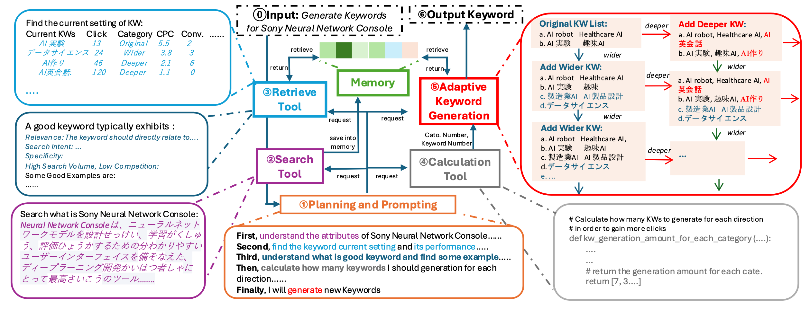

# OKG: On-the-fly Keyword Generation in Search Sponsered Advertising

## Description

This is the official implementation for the paper [**OKG: On-the-fly Keyword Generation in Search Sponsered Advertising**](https://aclanthology.org/2025.coling-industry.10/)) authored by Zhao Wang , Briti Gangopadhyay , Mengjie Zhao , Shingo Takamatsu,  submitted to COLING 2025. OKG is a dynamic framework leveraging LLM agent to adaptively generate keywords for sponsored search advertising. Additionally, we provided the first publicly accessible dataset with real ad keyword data, offering a valuable resource for future research in keyword optimization. 



## Installation

To install and run the project locally, follow these steps:

1. Clone the repository:
   ```bash
   git clone https://github.com/wang1946may7/OKG.git
   ```

2.  Creating a New Environment from a YAML File: You can create a new Conda environment from a YAML file on any system with Conda installed using:
   ```bash
   conda env create -f environment.yml
```


## Configuration File (.ini)

To run the agent, you need to AT LEAST replace items listed as follows including the keys and the ad product name. 
The project uses an `.ini` file to store various configurations and hyperparameters. Here’s a breakdown of the sections and their purposes:


### [CAMPAIGN]
- `PRODUCT_NAME`: The name of the product being advertised.

### [KEY] (need to replace them with your own keys)
- `OPENAI_GPT4_API_KEY`: API key for accessing GPT-4.
- `OPENAI_EMBEDDING_API_KEY`: API key for accessing OpenAI embeddings.
- `OPENAI_GPT4_AZURE_OPENAI_ENDPOINT`: Endpoint for GPT-4 Azure integration.
- `OPENAI_EMBEDDING_AZURE_OPENAI_ENDPOINT`: Endpoint for embedding API Azure integration.
- `SERPAPI_API_KEY`: API key for accessing SERPAPI services.

## Dataset

We present a publicly accessible dataset that includes real Japanese keyword data with its KPIs across various domains. The [dataset](https://github.com/wang1946may7/OKG/tree/main/dataset) includes real advertisement deliveries for 10 Sony products and IT services: Sony electronic devices like cameras and TVs, Sony financial services including Sony Bank mortgages and health insurance, and Sony AI platforms such as the Sony Neural Network Console and Prediction One. The dataset contains not only the actual delivered keywords but also the performance of each keyword, including search volume, clicks, competitor score, and cost-per-click.

[Dataset](https://github.com/wang1946may7/OKG/tree/main/dataset) - See this folder for more details on our datasets. Accessed on October 1, 2024.

## Usage
Run the main script:
   ```bash
   python main.py
   ```
## Experimental Result
We conducted experiments to evaluate our proposed OKG method against existing keyword generation approaches. The evaluation includes four aspects: real keyword performance, relevance and coverage, similarity with offline real keywords, and ablation study on OKG components. The results are summarized in the following tables.

### Comparison on Real Keyword Performance
*Clicks, Search Volumes, and CPC are normalized (denoted as N.) to overcome the impact of scale differences across different products.*

| Category  | Name           | Click ↑  | Srch. Vol. ↑  | CPC ↓  | Comp. Score ↓ |
|-----------|--------------|----------|-------------|--------|-------------|
|           |              | N. (0~100) | N. (0~100) | N. (0~1) | (0~100) |
| **LLM**   | **OKG**      | **100.0**  | 62.3        | **0.38** | **56**  |
|           | GPT-4        | 76.2       | **100.0**   | 0.63    | 78       |
|           | Gemini 1.5   | 69.1       | 57.30       | 0.62    | 83       |
| **Kwd. Ext.** | Choi     | 71.8       | 65.7        | 0.76    | 79       |
|           | RAKE        | 69.8       | 55.87       | 0.87    | 80       |
| **App.**  | Google KW Plnr. | 44.2   | 43          | 1.0     | 67       |

### Comparison on Relevance and Coverage with Source Meta-data

| Category   | Name            | Relevance (Bert-Score ↑) | Coverage (Bleu2 ↑) | Coverage (Rouge1 ↑) |
|------------|---------------|--------------------|----------------|----------------|
| **LLM**    | **OKG**       | **0.63**          | **0.27**       | **0.42**       |
|            | GPT-4         | 0.61              | 0.12           | 0.23           |
|            | Gemini 1.5    | 0.59              | 0.13           | 0.21           |
| **Kwd. Ext.** | Choi       | 0.45              | 0.14           | 0.22           |
|            | RAKE         | 0.48              | 0.16           | 0.23           |
| **App.**   | Google KW Plnr. | 0.40            | 0.12           | 0.19           |

### Comparison on Similarity with Offline Real Keywords

| Category   | Name            | Bert-Score ↑ | Jaccard ↑ | Cosine ↑ |
|------------|---------------|-------------|---------|--------|
| **LLM**    | **OKG**       | **0.85**    | **0.35** | **0.90** |
|            | GPT-4         | 0.72        | 0.30    | 0.78    |
|            | Gemini 1.5    | 0.71        | 0.28    | 0.72    |
| **Kwd. Ext.** | Choi       | 0.62        | 0.22    | 0.67    |
|            | RAKE         | 0.70        | 0.25    | 0.58    |
| **App.**   | Google KW Plnr. | 0.54      | 0.20    | 0.55    |

### Comparison Results of Component Ablation

| Method                  | BERTScore ↑ | Jaccard ↑ | Cos. Sim. ↑ | Clicks ↑ |
|-------------------------|------------|----------|------------|---------|
| **Full OKG**           | **0.83**    | **0.34** | **0.89**   | **13998** |
| **Fixed Growth OKG**   | 0.81       | 0.28     | 0.83       | 9803    |
| **Wide Growth Only**   | 0.78       | 0.23     | 0.81       | 7934    |
| **Deep Growth Only**   | 0.72       | 0.12     | 0.72       | 6543    |
| **OKG with Reflection** | 0.81       | 0.30     | 0.85       | 11200   |


## License
This project is licensed under the [Attribution-NonCommercial 4.0 International Lisence](https://creativecommons.org/licenses/by-nc/4.0/legalcode.en).

## Contributing
Contributions are welcome! Please fork the repository and submit a pull request for any improvements or bug fixes.

## Contact
For any questions or issues, feel free to reach out: Zhao.Wang@sony.com or this github repo for any information.

## Cite
If you use or reference OKG or the keyword dataset, please cite us with the following BibTeX entry:
```bibtex
@inproceedings{wang-etal-2025-okg,
    title = "{OKG}: On-the-Fly Keyword Generation in Sponsored Search Advertising",
    author = "Wang, Zhao  and
      Gangopadhyay, Briti  and
      Zhao, Mengjie  and
      Takamatsu, Shingo",
    booktitle = "Proceedings of the 31st International Conference on Computational Linguistics: Industry Track",
    month = jan,
    year = "2025",
    address = "Abu Dhabi, UAE",
    publisher = "Association for Computational Linguistics",
    pages = "115--127"
}
